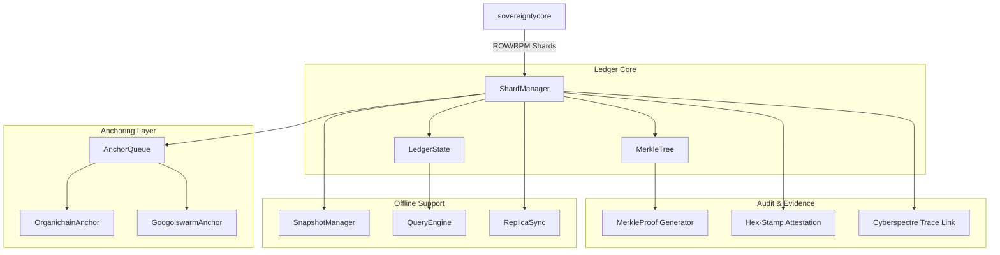

# ROW/RPM Ledger Architecture

## Overview

`row-rpm-ledger` is the **Audit & Effect Layer** of the Sovereign Spine, providing immutable storage for all governance decisions with offline-first operation and multi-ledger anchoring.

## Architecture Diagram

Key Design Principles
Append-Only - No modification or deletion of committed shards
Offline-First - Full operation without network connectivity
Cryptographically Proven - Merkle proofs for every shard
Multi-Ledger - Redundant anchoring for censorship resistance
Hex-Stamped - Every shard has deterministic attestation
Shard Types
[table-67b93c7c-d275-4873-951f-8fba73a161c9 (1).csv](https://github.com/user-attachments/files/25727617/table-67b93c7c-d275-4873-951f-8fba73a161c9.1.csv)
Type,Purpose,Immutable Fields
ROW,Resource ownership records,"row_id, timestamp, session_id, hex_stamp"
RPM,Resource performance metrics,"rpm_id, timestamp, session_id, hex_stamp"

Anchoring Strategy

[table-67b93c7c-d275-4873-951f-8fba73a161c9 (2).csv](https://github.com/user-attachments/files/25727632/table-67b93c7c-d275-4873-951f-8fba73a161c9.2.csv)
Ledger,Purpose,Frequency
Organichain,Primary anchor,Every 1000 shards
Googolswarm,Redundant anchor,Every 1000 shards
Zeta,Backup anchor,Every 10000 shards

Security Properties
Immutability - Committed shards cannot be modified
Verifiability - Merkle proofs enable independent verification
Auditability - Cyberspectre trace links to decision context
Censorship Resistance - Multi-ledger anchoring prevents single-point failure
Document Hex-Stamp: 0x3c4d5e6f7a8b9c0d1e2f3a4b5c6d7e8f9a0b1c2d3e4f5a6b7c8d9e0f1a2b3c4d
Last Updated: 2026-03-04
